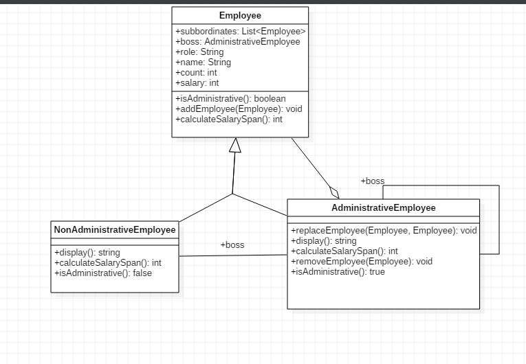

# Q3
##Why I chose Composite Pattern to solve the problem
The problem involved the creating of a hierarchical structure to define the organizational model of the company we narrowed it down. Once we completed the entity diagrams and studied how it should be structured it was easy to decide to use composite as the main bedrock of the solution. 

##Class Diagram

